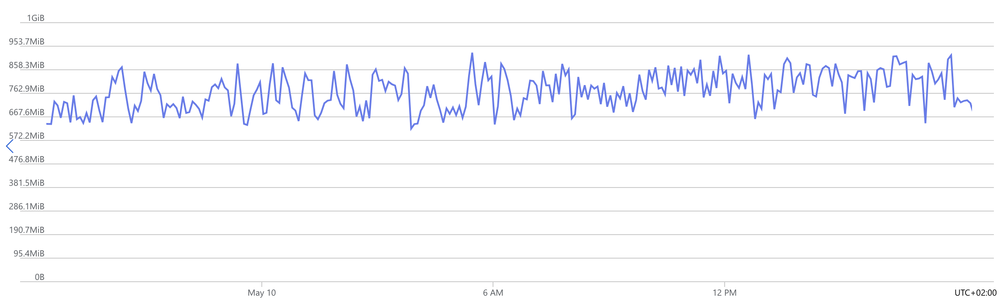
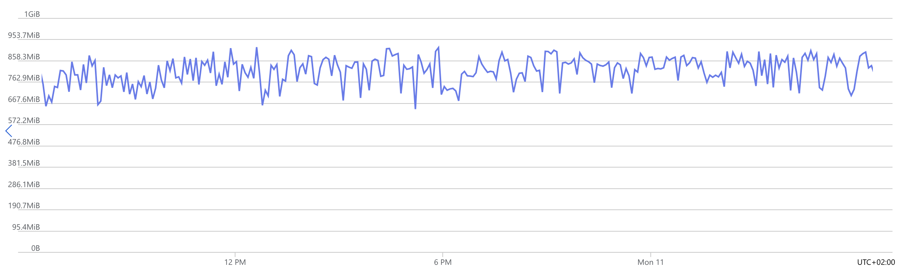
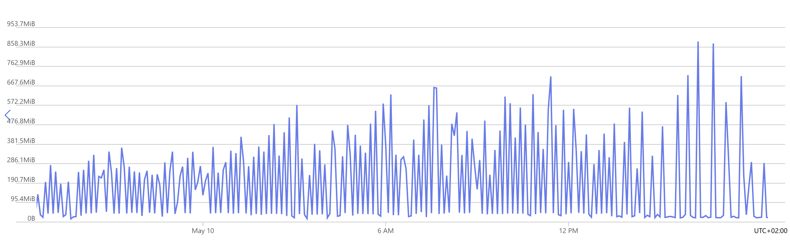
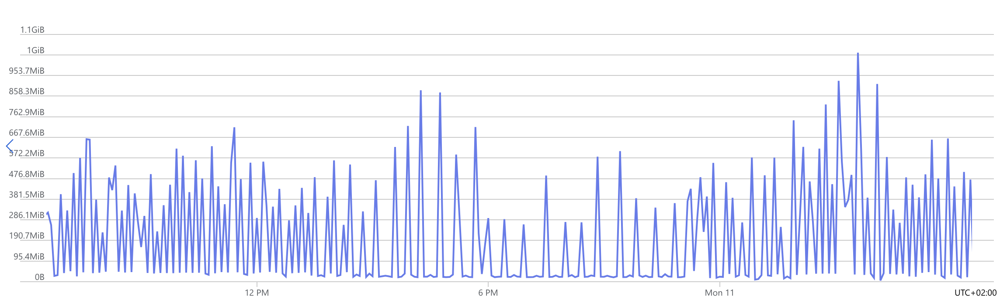
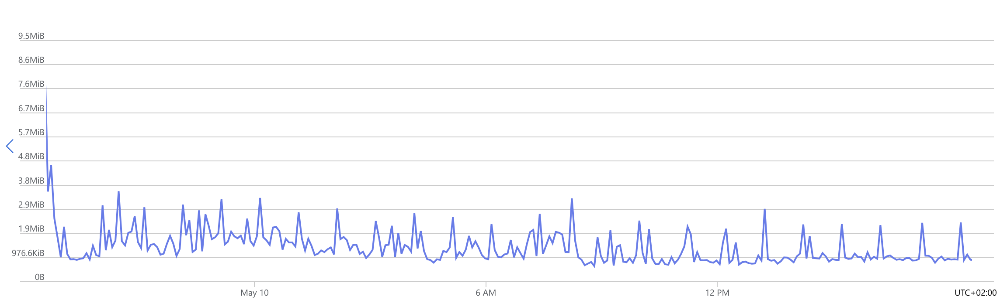
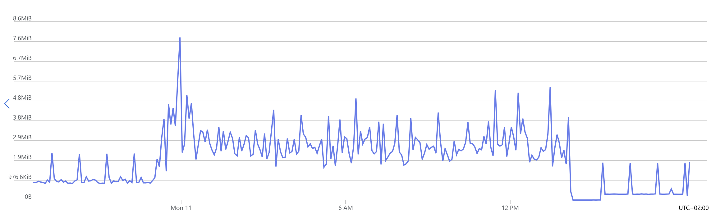

# The project is an asynchronous HTML page crawler for English-language content, with an integrated search engine and spell-cheching.

## Demo
[](https://github.com/user-attachments/assets/7866524a-54cf-4d7d-b6a0-b6b869bee8e9)
[](https://github.com/user-attachments/assets/57b49a4b-8cb2-4be2-896a-8b9b5669e5ad)

## Description
The project was created for stable, multithreaded indexing of a small volume of web pages in English (due to the relative simplicity of the language's linguistics), implementing all possible functionality using Go's built-in tools.

## Crawler
I implemented encoding handling and HTML content extraction via a tokenizer, sitemap.xml and robots.txt rule extraction, re-processing of already-visited pages using an LRU cache / BadgerDB. To preserve the information needed to continue crawling, I devised a naive formula (naive because we assume the quality of links on a given page depends on that page's own quality) for calculating task priority in the crawler's scheduler, and also implemented a min-max heap for the task buffer in the scheduler, plus an on-disk stack for persisting tasks between sessions and guarding against context-window staleness/rot.

## Indexer
I would describe it more as a library than a standalone component, since in the current implementation its parts are imported (implicitly) by both main packages. The indexer's primary job is to preprocess text before storing it in the inverted index, preprocess the search query before fetching documents, replace words considered erroneous with context awareness (word bigrams), control for near-duplicate documents (shingling and MinHash) across a run of n similar shingles, and perform standardization (Porter stemming algorithm) and word tokenization, the latter being functions of the indexer's child packages.

## Index
I implemented an inverted index that tracks both word counts and positions within documents. I also implemented shingling (MinHash) for checking the similarity of a crawled document against others in shards sharing similar hash segments, trigram indexing for spell correction using a file buffer to distribute load across files, a cache-like store of already-processed pages with their extracted links (for reprocessing when needed), and word bigrams for a full implementation of the noisy channel model.

## Search
In search, I believe algorithmic metrics for candidate selection play an important role, things like TF-IDF, BM25, and any metrics computable directly from the index, such as term proximity (meaning the minimum path between query terms within a document), as does semantic (vector) search based on meaning embeddings produced by various language transformers like the BERT model family, along with a ranking model on top of all that. Unfortunately, this part had to be dropped: training a quality model without metrics grounded in the current index (TF-IDF / BM25) was not feasible, and using a heavy BERT model was out of the question since I want to keep the search lightweight and undemanding on memory and CPU, let alone GPU, and I don't want to slow down indexing or search latency.

## Running
### Docker
```bash
mkdir .data
make docker-run
```
### Host
```bash
mkdir .data
make run
```

## Two-day benchmark
* documents idexed: 48963
* memory availability metrics:


* disk writes:


* network out:

