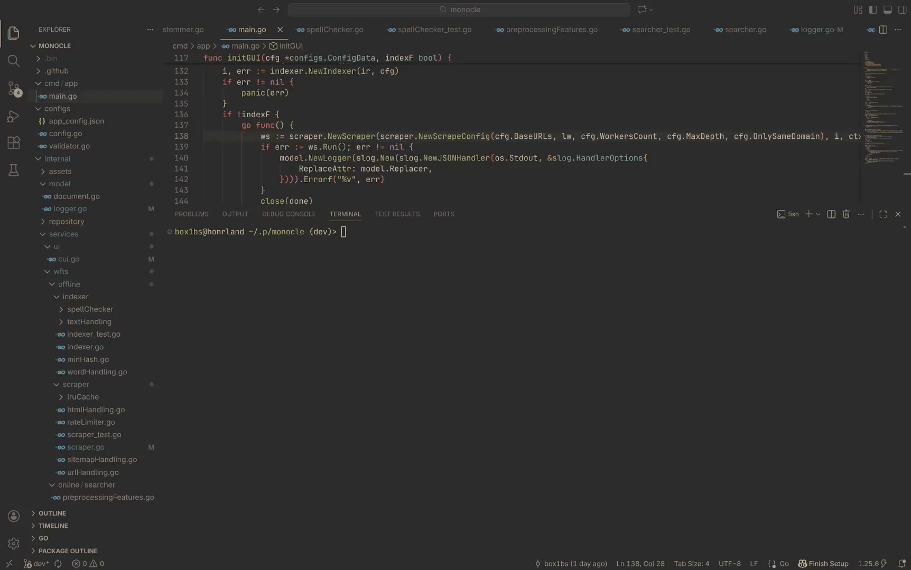

# Проект является асинхронным поисковым роботом html страниц на англ. языке, с интегрированныи поисковиком и исправлением опечаток.

## Демо


## Описание
Проект был создан для стабильной, многопоточной индексации небольшого объема веб страниц, на английском языке(из-за относительной простоты лингвистики этого языка), с реализацией всего, возможного функционала с помощью build-in инструментов языка golang, для этих целей были реализованы:

### Поисковой робот
В части обработки html была использована одна из трех внешних библиотек использованных в проекте, для обработки кодировок и извлечения html контента токенизатором, извлечение sitemap и robots.txt правил, переобработка уже посещенных страниц с помощью lru кэша/badger DB(вторая внешняя библиотека), для сохранения нужной для прохождения далее информацией, была придумана наивная(потому что мы считаем что качество ссылок, на которые ссылается обрабатываемая страница, зависят от ее качества) формула для подсчета приоритета задач для планировщика в поисковом роботе, а так же реализована min max куча для буффера задач в планировщике.

#### Индексер
Я хотел бы рассказать о нем как о библиотеке скорее, чем как об отдельном компоненте, поскольку в текущей реализации его части импортируются(неявно) обоими главными пакетами. Главная задача индексера в том, чтобы предобработать текст перед сохранением(инвертированный индекс), педобработать поисковую строку перем фетчингом документов в поиске и замены слов, которые мы считаем ошибочными, с учетом контекста(словестные биграммы), контроль схожих(шинглы и min hash) документов по ряду из n схожих шинглов, а так стандартизация(стемминг алгоритм Портера) и токенизация слов, что является функциями дочерних пакетов индексера.

#### Хранилище
В целом это тоже скорее либа, я реализовал сохранение документов по хэшу нормализованного url, обратный индекс, с учетом, как числа слов в документе, так и их позиций, как токенов, постепенную индексацию n-грам и шинглов, а так же salt массивом для непрерывной работы min hash алгоритма прямым с попмощью прямого бинарного чтения и записи.

### Поиск
В поиске, на мой взгляд, важную роль играют как алгоритмические метрики для отбора кандидатов, по типу term frequency * inverted document frequency, bm25, и любые метрики, которые можно рассчитать на основе индекса, то есть, для примера, term proximity под которой подразумевается минимальный путь между словами запроса в документе(важный момент, от первого слова), так и семантический(или векторный) поиск, который основывается на смысловых эмбеддингах полученных с помощью различных языковых трансформеров, по типу семейства Bert моделей, а так же модели/ей ранжирования поверх этого, с учетом уже новых метрик, для ранжирования, или реранжирования результатов, но к сожелению эту часть пришлось отбросить, из-за невозможности обучить качественную модель, без метрик ориентированных на текущий индекс(tf idf | bm25) и невозможности использования можной Bert модели, из-за жедания сохранить легковесность и скорость индексации и поиска.

## Запуск
##### cli
```Для Linux|MacOs
make index
```
##### tui
```Для Linux|MacOs
make index-gui
```

##### cli
```Для Windows
go run ./cmd/app/main.go
```
##### tui
```Для Windows
go run ./cmd/app/main.go --gui
```